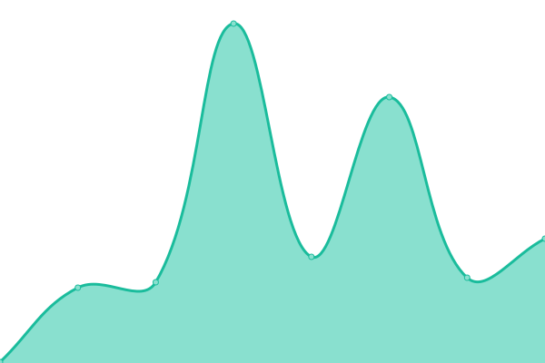
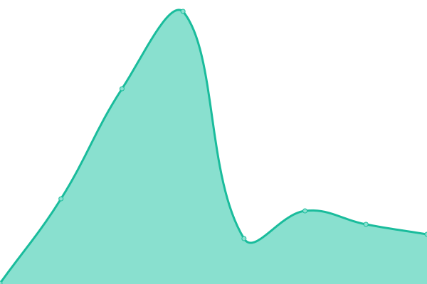

# [📈 Live Status](https://pixifydigitalagency.github.io/monitors): <!--live status--> **🟩 All systems operational**

This repository contains the open-source uptime monitor and status page for [Pixify Digital Agency](https://www.pixify.co.uk/), powered by [Upptime](https://github.com/upptime/upptime).

With [Upptime](https://upptime.js.org), you can get your own unlimited and free uptime monitor and status page, powered entirely by a GitHub repository. We use [Issues](https://github.com/pixifydigitalagency/monitors/issues) as incident reports, [Actions](https://github.com/pixifydigitalagency/monitors/actions) as uptime monitors, and [Pages](https://pixifydigitalagency.github.io/monitors) for the status page.

<!--start: status pages-->
<!-- This summary is generated by Upptime (https://github.com/upptime/upptime) -->
<!-- Do not edit this manually, your changes will be overwritten -->
<!-- prettier-ignore -->
| URL | Status | History | Response Time | Uptime |
| --- | ------ | ------- | ------------- | ------ |
|  [Corporate Website](https://www.pixify.co.uk/) | 🟩 Up | [corporate-website.yml](https://github.com/pixifydigitalagency/monitors/commits/HEAD/history/corporate-website.yml) | 

 1170ms
     
 | 

<a href="https://pixifydigitalagency.github.io/monitors/history/corporate-website">25.64%</a>
    

|  [Edge Platform](https://edge.pixify.co.uk/) | 🟩 Up | [edge-platform.yml](https://github.com/pixifydigitalagency/monitors/commits/HEAD/history/edge-platform.yml) | 

 849ms
     
 | 

<a href="https://pixifydigitalagency.github.io/monitors/history/edge-platform">28.78%</a>
    

|  [Senditure Email Marketing](https://www.senditure.co.uk/) | 🟩 Up | [senditure-email-marketing.yml](https://github.com/pixifydigitalagency/monitors/commits/HEAD/history/senditure-email-marketing.yml) | 

 1108ms
     
 | 

<a href="https://pixifydigitalagency.github.io/monitors/history/senditure-email-marketing">100.00%</a>
    

|  [Broken Test Site](https://www.pixify.co.uk/) | 🟩 Up | [broken-test-site.yml](https://github.com/pixifydigitalagency/monitors/commits/HEAD/history/broken-test-site.yml) | 

 1001ms
     
 | 

<a href="https://pixifydigitalagency.github.io/monitors/history/broken-test-site">28.76%</a>
    

<!--end: status pages-->

[**Visit our status website →**](https://pixifydigitalagency.github.io/monitors)

## 📄 License

- Powered by: [Upptime](https://github.com/upptime/upptime)
- Code: [MIT](./LICENSE) © [Pixify Digital Agency](https://www.pixify.co.uk/)
- Data in the `./history` directory: [Open Database License](https://opendatacommons.org/licenses/odbl/1-0/)
